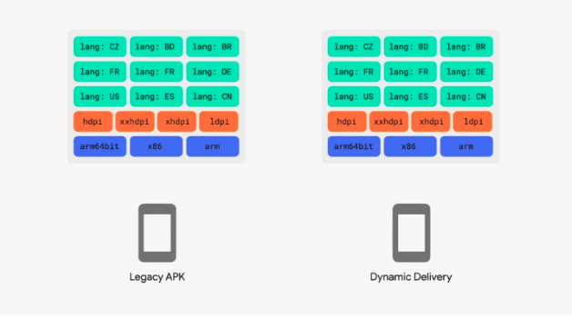

# Training App bundle và Dynamic delivery

## I. Các khái niệm
### 1. Giới thiệu
Ở Google I/O 2018, một định dạng xuất bản mới đã được giới thiệu cho các ứng dụng Android có tên là Android App Bundle.

Đây là một định dạng tải lên mới bao gồm tất cả các resource và code đã được compile, nhưng chưa tạo APK và ký vào Google Play.

 Nó sẽ ảnh hưởng đến cách chúng ta xây dựng và cấu trúc các ứng dụng của chúng ta theo một định dạng modules
Dạng format sẽ là .aab

### 2. Lợi ích
- **Kích thước ứng dụng nhỏ hơn:** dùng kĩ thuật Split Apk, các gói riêng biệt được cài đặt trên thiết bị của người dùng theo yêu cầu. Trung bình một app publish với app bundle kích thước sẽ nhỏ hơn 20%

- **Không còn phải quản lý nhiều file APK:** không còn phải build, sign và quản lý nhiều APK để hỗ trợ nhiều loại devices và người dùng sẽ chỉ phải down file kích thước nhỏ hơn. Ví dụ giờ sẽ không phải tạo nhiều APK cho nhiều cỡ màn hình.

- **Dynamic Delivery:** chỉ tải code và resource người dùng cần cho app của họ, dùng app bundle để gen các file apk cho mỗi cấu hình của thiết bị sử dụng. Ví dụ nếu Tiếng Anh là ngôn ngữ chính thì sẽ không cần các ngôn ngữ khác

- **Tối ưu cho việc tích hợp Instant app:** người dùng có thể chạy ứng dụng của bạn ngay lập tức mà không phải cài đặt ứng dụng

- **Module Dynamic Feature:** những module, tính năng mà người dùng chưa cần khi lần đầu cài app. Sử dụng Play Core Library, app có thể request để tải về thêm những tính năng cần.

### 3. Cấu trúc
 Với apk, người dùng có thể cài đặt trực tiếp lên thiết bị, nhưng với app bunlde thì lại không. App bunlde chứa một số nội dung mà apk không có. 
 


- base/, feature1/, feature2/: đây là các module của app. Module cơ bản của app ở trong  base/. Để cầu hình đường dẫn cho feature1/, feature2/, ta cấu hình trong manifest của từng module, với thẻ split

- manifest/: không giống như APK, gói ứng dụng lưu trữ tệp AndroidManifest.xml của mỗi mô-đun trong thư mục riêng biệt này.

- dex /: Không giống như APK, gói ứng dụng lưu trữ các tệp DEX cho mỗi mô-đun trong thư mục riêng biệt này.

- res /, lib / và assets /: Các thư mục này giống hệt với các thư mục trong APK thông thường. Khi bạn tải lên gói ứng dụng của mình, Google Play sẽ chỉ kiểm tra các thư mục và gói này các tệp đáp ứng cấu hình thiết bị đích, trong khi vẫn giữ đường dẫn tệp.
…

### 4. .Aab vs apks
### Multiple APKs = apks


### 5. Dynamic delivery (Phân phối động)
### a. Giải thích
Các tính năng,  cấu hình ban đầu: ngôn ngữ, độ phân giải màn hình, cấu trúc CPU



Khi được cài lên device, apk sẽ lấy tất cả các tính năng, cấu hình đó để đưa vào apk, còn Dynamic delivery chỉ chọn những cái phù hợp để đưa vào


### Split apk được chia làm 3 loại
- **Base apk:** APK này chứa code và resource mà tất cả các APK phân tách khác có thể truy cập và cung cấp chức năng cơ bản cho ứng dụng của bạn. Khi người dùng download ứng dụng của bạn chắc chắn có file APK này

- **Configuration apk:** Mỗi APK trong số này bao gồm native libraries và resource cho từng cấu hình device cụ thể, nó sẽ tối ưu hóa nội dung APK theo dựa theo :

Ngôn ngữ

Mật độ màn hình

Kiến trúc CPU

Khi bạn build abb, theo mặc định, tất cả các phần tách sẽ được tạo, nhưng trong build.gradle, ta có thể khai báo những phần tách nào sẽ được tạo:


Ban đầu, các thuộc tính này sẽ được đặt thành true. Tuy nhiên, đặt một thành false có nghĩa là nó không hỗ trợ phân tách phần đó trong APK config, có nghĩa là nó sẽ được đóng gói trong Base APK hoặc Dynamic-Feature APK

- **Dynamic feature APKs:** Mỗi APK này chứa code và resource không bắt buộc khi ứng dụng của bạn được cài đặt lần đầu, nhưng có thể được tải xuống và cài đặt sau.

### 6. Dynamic feature module

Dynamic feature module cho phép bạn tách các tính năng và tài nguyên nhất định khỏi module cơ sở của ứng dụng và đưa chúng vào aab. Thông qua Dynamic Delivery, sau này người dùng có thể tải xuống và cài đặt các thành phần đó theo yêu cầu sau khi họ đã cài đặt APK cơ sở của ứng dụng của bạn.

Ví dụ, một ứng dụng nhắn tin văn bản bao gồm chức năng chụp và gửi tin nhắn hình ảnh, nhưng chỉ một phần nhỏ người dùng gửi tin nhắn hình ảnh. Có thể có ý nghĩa khi đưa tin nhắn hình ảnh làm nó thành Dynamic feture module có thể tải xuống. Bằng cách đó, tải xuống ứng dụng ban đầu nhỏ hơn cho tất cả người dùng và chỉ những người dùng gửi tin nhắn hình ảnh đó mới cần tải xuống thành phần bổ sung đó.

## II. Code
### 1. Dynamic feature module
### a. Tạo một module động

Android hỗ trợ tạo module động như sau


Sau đó có thể thay đổi Module name, package name, api level


Có 2 thuộc tính quan trọng
- **Enable on-demand:** có cho phép down module ở lần đầu tiên cài app hay không. Nếu không thì khi nào người dùng request thì mới down xuống
- **Fusing:** nếu muốn module này dùng được trên các thiết bị chạy API 20 trở xuống (Android 4.4) và thêm nó vào multi-APKs

Tạo xong thì sẽ có file AndroidManifest.xml của module
```
<?xml version="1.0" encoding="utf-8"?>
<manifest xmlns:android="http://schemas.android.com/apk/res/android"
         xmlns:dist="http://schemas.android.com/apk/distribution"
         package="com.example.dynamic_feature"
         split="dynamic_feature">

   dist:module
           dist:onDemand="true"
           dist:title="@string/title_dynamic_feature">
       dist:fusing dist:include="true"/>
   </dist:module>

</manifest>
```

Sau đó Android sẽ tự thêm cho ta:
- Vào thẻ include trong setting.gradle tên module mới
```
include ':app', ':dynamic_feature', ':dynamic_feature2'
```

- Trong build.gradle của module app, sẽ thêm trường, nơi ta sẽ định nghĩa các module

```
dynamicFeatures = [":dynamic_feature", ":dynamic_feature2"]
```

- Trong build.gralde của dynamic module
```
dependencies {
   implementation fileTree(dir: 'libs', include: ['*.jar'])

// Khai báo phụ thuộc vào base module app
   implementation project(':app')
}
```

### b. Down một module động

#### - Include Play Core Library
```
dependencies {
    implementation 'com.google.android.play:core:1.3.4'
}
```

#### - Request một demand cho dynamic feature module
 Có hai cách: 
Sử dụng SplitInstallManager.startInstall (): Ứng dụng của bạn cần ở foreground để gửi yêu cầu.

Khi ứng dụng của bạn yêu cầu một mô-đun theo yêu cầu, Thư viện Play Core sẽ thực hiện theo kiểu không đồng bộ.

Đó là, nó sẽ gửi yêu cầu tải mô-đun xuống nền tảng, nhưng nó không theo dõi xem việc cài đặt có thành công hay không.

Vì vậy, bạn có trách nhiệm theo dõi trạng thái yêu cầu (giải thích sau).
SplitInstallManager.deferredInstall(): cài module khi ở background. Với cách này thì ta không thể theo dõi tiến trình. Vì vậy trước khi truy cập vào một module đã chỉ định cài đặt trì hoãn, ta nên kiểm tra module đã được cài đặt hay chưa.

Ta có thể kiểm soát state của demand (xem code), cancel download, uninstall module, ...


### 2. Sử dụng bundle tool
#### a.Định nghĩa
Sau khi bạn xây dựng Gói ứng dụng Android, bạn nên kiểm tra cách Google Play sử dụng nó để tạo APK và cách các APK đó hoạt động khi được triển khai cho thiết bị.

  Có hai cách bạn nên xem xét việc kiểm tra gói ứng dụng của mình: cục bộ bằng cách sử dụng công cụ dòng lệnh bundletool và thông qua Google Play bằng cách tải gói của bạn lên Play Console và sử dụng test track.

  Trang này giải thích cách sử dụng bundletool để kiểm tra gói ứng dụng của bạn cục bộ.
#### b. Công dụng
#### - Gen set các APKs từ app bundle

```
 bundletool build-apks 
 
 **--bundle**=/home/nguyen.ngoc.trungc/AndroidStudioProjects/Training/Training_AppBunlde/app/build/outputs/bundle/debug/app.aab 
 
 **--output**=/home/nguyen.ngoc.trungc/AndroidStudioProjects/Training/Training_AppBunlde/app/build/outputs/bundle/debug/my_app.apks
```


Kết quả: 


==> Không cài được, chia theo ngôn ngữ, độ phân giải màn hình

Ngoài ra còn có thể setting thêm nhiều thuộc tính khác


#### -Cài đặt APK từ APK Set tương thích với thiết bị được kết nối.
```
bundletool install-apks --apks=/MyApp/my_app.apks
```

Ví dụ: nếu bạn có thiết bị được kết nối chạy Android 5.0 (API 21) trở lên, bundletool sẽ đẩy base APK, dynamic feature APKs và configuration APKs cần thiết để chạy ứng dụng của bạn trên thiết bị đó.

Ngoài ra, nếu thiết bị được kết nối của bạn đang chạy Android 4.4 (API 20) hoặc thấp hơn, bundletool sẽ tìm một APK đa tương thích và triển khai nó cho thiết bị của bạn.

Nhiều thiết bị thì dùng --device-id=serial-number


#### -Trích xuất (các) APK từ Bộ APK tương thích với một thiết bị nhất định.

#### --connected-device
Để ngôn ngữ máy là Tiếng Anh - xxhdpi


Để ngôn ngữ máy là Tiếng Việt - xxhdpi


Độ phân giải màn hình khác - xhdpi


#### -Trích xuất thông số thiết bị dưới dạng tệp JSON.
```
bundletool get-device-spec --output=/tmp/device-spec.json
```
```
{
  "supportedAbis": ["x86"],
  "supportedLocales": ["vi"],
  "deviceFeatures": ["reqGlEsVersion=0x20000", "android.hardware.audio.output", "android.hardware.camera", "android.hardware.camera.any", "android.hardware.faketouch", "android.hardware.fingerprint", "android.hardware.location", "android.hardware.location.gps", "android.hardware.location.network", "android.hardware.microphone", "android.hardware.screen.landscape", "android.hardware.screen.portrait", "android.hardware.sensor.accelerometer", "android.hardware.sensor.ambient_temperature", "android.hardware.sensor.barometer", "android.hardware.sensor.compass", "android.hardware.sensor.gyroscope", "android.hardware.sensor.light", "android.hardware.sensor.proximity", "android.hardware.sensor.relative_humidity", "android.hardware.telephony", "android.hardware.telephony.gsm", "android.hardware.touchscreen", "android.hardware.touchscreen.multitouch", "android.hardware.touchscreen.multitouch.distinct", "android.hardware.touchscreen.multitouch.jazzhand", "android.hardware.wifi", "android.software.app_widgets", "android.software.backup", "android.software.connectionservice", "android.software.device_admin", "android.software.home_screen", "android.software.input_methods", "android.software.live_wallpaper", "android.software.managed_users", "android.software.midi", "android.software.print", "android.software.voice_recognizers", "android.software.webview", "com.google.android.feature.EXCHANGE_6_2", "com.google.android.feature.GOOGLE_BUILD", "com.google.android.feature.GOOGLE_EXPERIENCE"],
  "screenDensity": 480,
  "sdkVersion": 25
}
```
Rồi có thể dùng file JSON trên để gen apk cho thiết bị:
```
bundletool build-apks --device-spec=/MyApp/pixel2.json
--bundle=/MyApp/my_app.aab --output=/MyApp/my_app.apks
```

#### Ngoài ra còn có thể extract apk từ apks có sẵn, vs file JSON đã gen, đo kích thước download

### 3. Upgrade các ứng dụng đã có để sử dụng dynamic feature module
Từ một module thường, ta có thể tạo cho nó thành dynamic module

Làm các bước giống lúc tạo một module động
